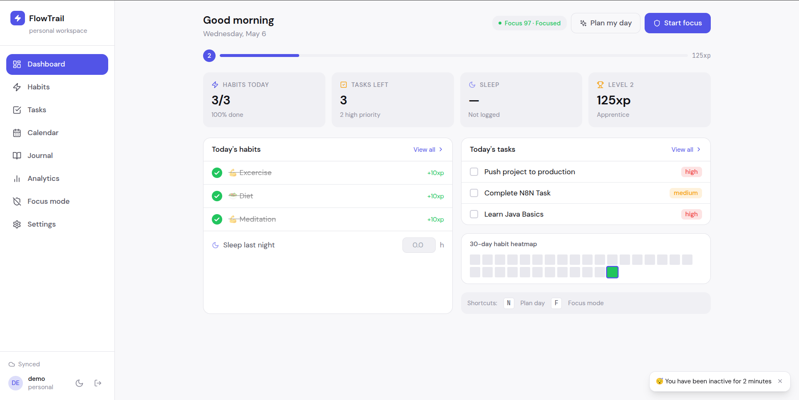
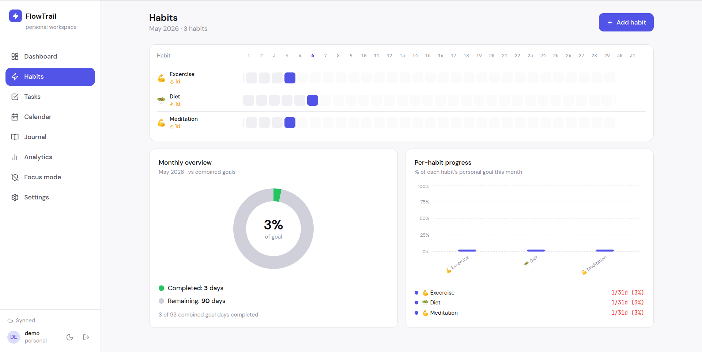
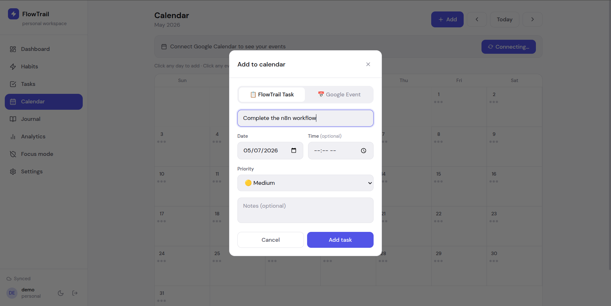
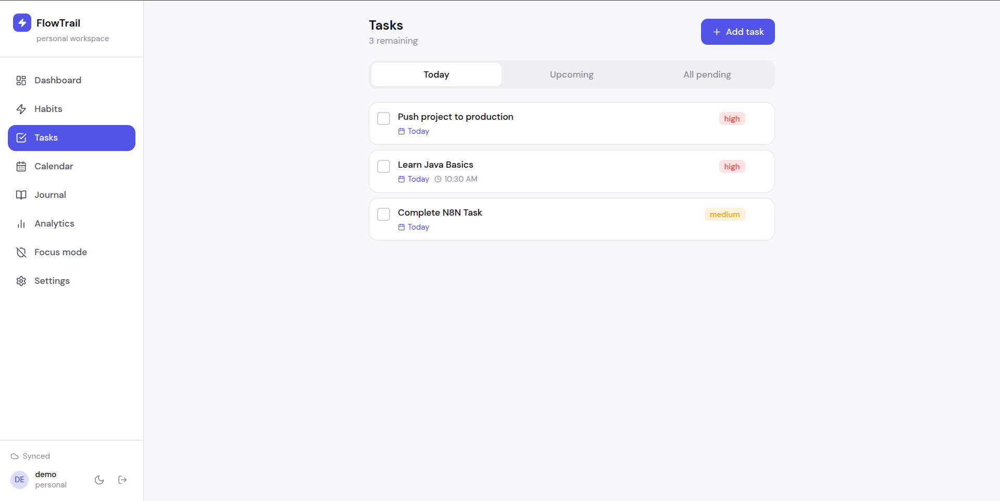
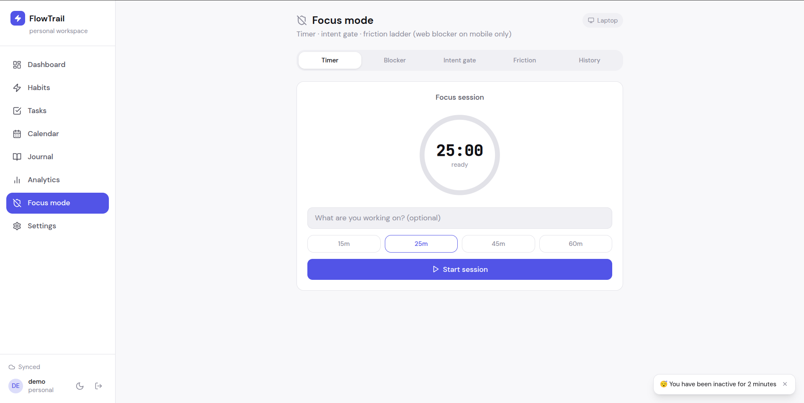
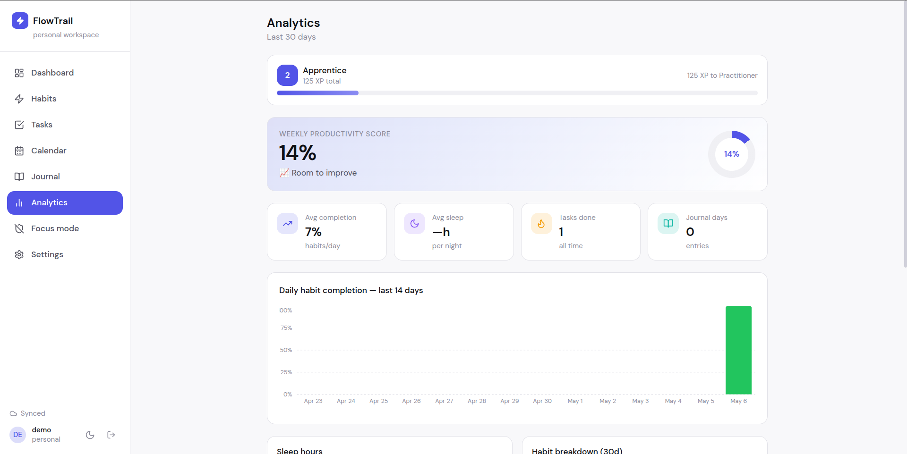

<div align="center">


# FlowTrail

### Your personal productivity command center

**Control distractions. Build discipline. Track your progress.**

[](https://flowtrail-delta.vercel.app)
[](https://react.dev)
[](https://supabase.com)
[](https://vitejs.dev)

</div>

---

## What is FlowTrail?

FlowTrail is a **full-stack personal productivity PWA** that combines everything you need to build better habits, stay focused, and track your growth — all in one place, synced across all your devices in real time.

Built entirely from scratch as a solo project — from database schema to UI design to deployment.

---

## Screenshots

> **Add your screenshots here after taking them**

| Dashboard | Habits | Calendar |
|---|---|---|
|  |  |  |

| Tasks | Focus Mode | Analytics |
|---|---|---|
|  |  |  |

---

## Features

- **Habit tracker** — daily grid view, streaks, colour-coded per habit
- **To-do list** — priorities (high/med/low), due dates, filter by today/upcoming/all
- **Calendar** — unified monthly view of habits and tasks
- **Journal** — daily rich-text writing with rotating prompts, auto-save, word count, entry history
- **Analytics** — completion charts, sleep trends, per-habit breakdown
- **Sleep logging** — track hours slept, see patterns over time
- **Dark & light mode** — toggle anytime, persisted across sessions
- **Offline-first** — works without internet, syncs when connected
- **Cross-device sync** — same data on laptop, phone, and tablet via Supabase real-time
- **PWA** — install on Android (Add to Home Screen) and Windows (Chrome install)

---

## Tech Stack

### Frontend
| Technology | Purpose |
|---|---|
| **React 18** | UI framework with hooks |
| **Vite** | Build tool + dev server |
| **TailwindCSS** | Utility-first styling |
| **Zustand** | Global state management (persisted) |
| **Dexie.js** | IndexedDB wrapper for offline-first data |
| **Tiptap** | Rich text editor for journal |
| **Recharts** | Charts (pie, bar, line) |
| **React Router v6** | Client-side routing |
| **date-fns** | Date utilities |
| **vite-plugin-pwa** | PWA manifest + service worker |

### Backend & Services
| Technology | Purpose |
|---|---|
| **Supabase** | PostgreSQL database + Auth + Real-time subscriptions |
| **Supabase Auth** | Email/password + Google OAuth |
| **Google Calendar API** | Read/write calendar events |
| **Google Identity Services** | OAuth token for Calendar access |
| **Anthropic Claude API** | AI task planning |
| **Vercel** | Frontend hosting + Edge functions |

---

## Architecture

```
┌─────────────────────────────────────────────────────┐
│                    Client (Browser)                  │
│                                                       │
│  React + Zustand ←→ Dexie (IndexedDB)               │
│       ↕ real-time                ↕ offline cache     │
│  Supabase Client          Service Worker (PWA)       │
└───────────────┬─────────────────────────────────────┘
                │ HTTPS
┌───────────────▼─────────────────────────────────────┐
│                    Supabase                           │
│                                                       │
│  PostgreSQL ←→ Auth ←→ Realtime WebSocket           │
│  Row Level Security (each user sees only their data) │
└─────────────────────────────────────────────────────┘
                │
┌───────────────▼─────────────────────────────────────┐
│              Vercel Edge Function                     │
│              /api/plan.js                            │
│         (Anthropic API proxy — no CORS)              │
└─────────────────────────────────────────────────────┘
```

### Sync Strategy
```
User action (e.g. add task)
  → Write to IndexedDB immediately (instant UI update)
  → Upsert to Supabase (background)
  → Supabase broadcasts change via WebSocket
  → Other devices receive change and update IndexedDB
  → UI updates on all devices
```

### Database Schema
```sql
profiles          -- user XP, badges, gamification data
habits            -- habit definitions with goals
habit_logs        -- daily completion records
tasks             -- tasks with priority, due date, due time
journal_entries   -- multiple entries per day per user
sleep_logs        -- nightly sleep hours
```

---

## Project Structure

```
flowtrail/
├── api/
│   └── plan.js                  # Vercel edge function (AI planner)
├── public/
│   ├── favicon.svg
│   ├── icon-192.png             # PWA icons
│   └── icon-512.png
├── src/
│   ├── components/
│   │   ├── layout/
│   │   │   ├── AppShell.jsx     # Main app wrapper
│   │   │   ├── Sidebar.jsx      # Desktop navigation
│   │   │   └── BottomNav.jsx    # Mobile navigation
│   │   └── ui/
│   │       ├── XPBar.jsx        # Gamification progress bar
│   │       ├── FocusScore.jsx   # Dopamine control widget
│   │       ├── PlanMyDay.jsx    # AI planner modal
│   │       └── Modal.jsx
│   ├── hooks/
│   │   ├── useHabits.js         # Habit CRUD + XP
│   │   ├── useTasks.js          # Task CRUD + notifications
│   │   └── useJournal.js        # Journal CRUD
│   ├── lib/
│   │   ├── supabase.js          # Supabase client (PKCE auth)
│   │   ├── db.js                # Dexie schema (v3 with migrations)
│   │   ├── sync.js              # Bi-directional sync engine
│   │   ├── gamificationSync.js  # XP sync to Supabase profiles
│   │   ├── googleCalendar.js    # Google Calendar API wrapper
│   │   └── notifications.js     # Web Notifications API helpers
│   ├── pages/
│   │   ├── Landing.jsx          # Marketing + auth page
│   │   ├── Dashboard.jsx        # Home with stats + heatmap
│   │   ├── Habits.jsx           # Month grid + charts
│   │   ├── Tasks.jsx            # Task list with grouping
│   │   ├── Calendar.jsx         # Month calendar + Google sync
│   │   ├── Journal.jsx          # Rich text journal
│   │   ├── Analytics.jsx        # Charts + badges
│   │   ├── Focus.jsx            # Pomodoro + blocker
│   │   └── Settings.jsx
│   └── store/
│       ├── appStore.js          # Theme + user (persisted)
│       ├── gamificationStore.js # XP + levels + badges (persisted)
│       ├── dopamineStore.js     # Focus score + warnings
│       └── focusStore.js        # Blocked sites + sessions (persisted)
├── supabase/
│   └── schema.sql               # Full database schema
├── vercel.json                  # SPA rewrite rules
└── vite.config.js               # PWA config
```

---

## Getting Started

### Prerequisites
- Node.js 18+
- A [Supabase](https://supabase.com) account (free)
- A [Vercel](https://vercel.com) account (free)
- Optional: Google Cloud Console project (for Calendar integration)

### Local Setup

```bash
# 1. Clone the repo
git clone https://github.com/harishsivakumarjs/flowtrail
cd flowtrail

# 2. Install dependencies
npm install

# 3. Set up environment variables
cp .env.example .env
# Edit .env with your Supabase URL and anon key

# 4. Run database migrations
# Go to Supabase → SQL Editor → paste contents of supabase/schema.sql

# 5. Start the dev server
npm run dev
# Open http://localhost:5173
```

### Deploy to Vercel

```bash
# Push to GitHub, then connect repo to Vercel
# Add environment variables in Vercel dashboard:
#   VITE_SUPABASE_URL
#   VITE_SUPABASE_ANON_KEY
#   VITE_GOOGLE_CLIENT_ID
#   ANTHROPIC_API_KEY  (for AI planner)
```

---

## Environment Variables

| Variable | Required | Description |
|---|---|---|
| `VITE_SUPABASE_URL` | ✅ | Your Supabase project URL |
| `VITE_SUPABASE_ANON_KEY` | ✅ | Supabase public anon key |
| `VITE_GOOGLE_CLIENT_ID` | Optional | Google OAuth client ID (for Calendar) |
| `ANTHROPIC_API_KEY` | Optional | Claude API key (Vercel only, never in frontend) |

---

## Key Design Decisions

**Why offline-first?**
Most productivity apps break without internet. FlowTrail writes to IndexedDB first so the UI is always instant — syncing happens in the background.

**Why Dexie over direct Supabase?**
Supabase queries have network latency. Dexie gives sub-millisecond reads from IndexedDB, making the app feel native-speed even on slow connections.

**Why Zustand over Redux?**
Zustand's API is minimal and it integrates cleanly with Zustand persist for localStorage. No boilerplate, no reducers, no context hell.

**Why a Vercel edge function for AI?**
The Anthropic API blocks browser requests (CORS). A thin edge function proxies the request server-side. Zero extra infrastructure needed.

---

## What I Learned Building This

- **Offline-first architecture** — managing sync conflicts, UUID vs auto-increment IDs, and the `deletedIds` set pattern to prevent deleted records from reappearing
- **Real-time WebSocket subscriptions** — Supabase Postgres Changes with echo prevention (ignoring your own writes coming back via realtime)
- **PWA on Android** — manifest requirements, service worker caching strategies, and why SVG icons don't work for PWA installation
- **Google OAuth without a backend** — using Google Identity Services popup flow for calendar token separately from Supabase auth
- **Dexie schema migrations** — upgrading from integer to UUID primary keys without losing data

---

## License

MIT — free to use, modify, and distribute.

---

<div align="center">

Built with ☕ and determination by [Harish Sivakumar](https://github.com/harishsivakumarjs)

⭐ Star this repo if you found it useful!

</div>